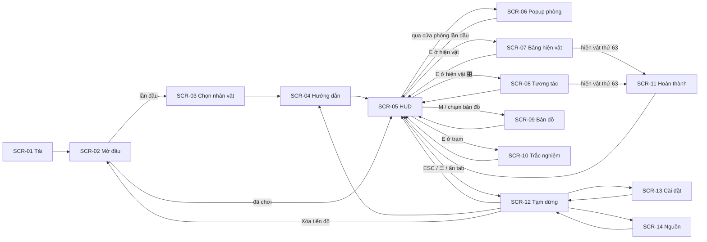

# FSD — Đặc tả chức năng theo màn hình — Bảo tàng Triết học

| Phiên bản | v0.1 | Ngày | 2026-10-06 | Trạng thái | APPROVED — GATE-3 (anh Duy, 2026-10-06) |
|-----------|------|------|------------|------------|--------------------|

## 1. Giới thiệu

FSD đặc tả **hành vi trên màn hình** của các FR trong [SRS v1.0](SRS.md); bố cục và token ở [design.md](../design/design.md); module và hàm ở [LLD](../sa/LLD.md). FSD chỉ tham chiếu FR/BR, không chép lại quy tắc. Mâu thuẫn thì SRS thắng.

Dự án không có backend nên **không có API**. Ở các bảng dưới, cột "API" được thay bằng **"Module · hàm"** (giao diện nội bộ định nghĩa ở LLD mục 2).

FR được phủ: FR-01 → FR-27 (FR-26 là bước build, không có màn hình; xem ma trận mục 4).

**Quy ước chung cho mọi lớp giao diện (overlay):**
- Chỉ một lớp mở tại một thời điểm (HLD 4.1); khi lớp mở: khung 3D phủ `--scrim`, HUD ẩn, nhân vật không nhận điều khiển, pointer lock được nhả.
- ESC hoặc nút ✕ đóng lớp trên cùng; lớp có hộp xác nhận thì ESC tương đương nút an toàn.
- Mở lớp → focus vào phần tử tương tác đầu tiên (hoặc nút an toàn với hộp xác nhận); đóng lớp → focus về canvas.
- Văn bản thông báo dùng mã `MSG-xx` ở mục 5.

## 2. Bản đồ màn hình

| Mã | Tên màn hình | FR phủ | Trạng thái app (HLD 4.1) |
|----|--------------|--------|---------------------------|
| SCR-01 | Màn tải / không hỗ trợ / lỗi tải | FR-01 | `boot`, `loading`, `unsupported`, `load-error` |
| SCR-02 | Màn mở đầu | FR-01, FR-19 | `title` |
| SCR-03 | Chọn nhân vật | FR-02 | `character-select` |
| SCR-04 | Hướng dẫn | FR-03 | `tutorial` (hoặc lớp con của `paused`/`playing`) |
| SCR-05 | HUD khi chơi | FR-04 → FR-07, FR-10 → FR-12, FR-15, FR-19, FR-22 → FR-25 | `playing` |
| SCR-06 | Popup vào phòng | FR-09 | `room-popup` |
| SCR-07 | Bảng hiện vật | FR-13, FR-15 | `exhibit` |
| SCR-08 | Hiện vật tương tác | FR-14 | `exhibit` |
| SCR-09 | Bản đồ phóng to | FR-10, FR-17 | `playing` (lớp phụ) |
| SCR-10 | Trắc nghiệm | FR-16, FR-17 | `quiz` |
| SCR-11 | Màn hoàn thành | FR-18 | `completion` |
| SCR-12 | Menu tạm dừng (+ hộp xác nhận xóa) | FR-07, FR-20, FR-21 | `paused` |
| SCR-13 | Cài đặt | FR-02, FR-22 | `paused` (lớp con) |
| SCR-14 | Nguồn & giấy phép | FR-27 | `paused` (lớp con) |
| SCR-15 | Gợi ý xoay ngang | FR-06 | `playing` (lớp phụ, chỉ điện thoại màn dọc) |

## 3. Đặc tả từng màn hình

### SCR-01 — Màn tải / không hỗ trợ / lỗi tải *(FR-01)*
- **Tiền điều kiện:** vừa mở URL. Wireframe: nền tối, giữa màn.
- **Bảng element:**

  | # | Element | Loại | Hành vi / điều kiện hiển thị | Module · hàm | Thông báo |
  |---|---------|------|------------------------------|--------------|-----------|
  | 1 | Tên "Bảo tàng Triết học" | text | Luôn hiện | — | — |
  | 2 | Thanh tiến trình + "%" | progress | Hiện ở `loading`; % = byte đã nhận / tổng byte gói ban đầu, làm tròn xuống | `core/loader.loadBundle(onProgress)` | — |
  | 3 | Dòng mạng chậm | text | Hiện khi `loading` quá 30 giây | — | MSG-03 |
  | 4 | Khối lỗi WebGL2 | text | Chỉ ở `unsupported`; không có nút | `core/renderer.hasWebGL2()` | MSG-01 |
  | 5 | Khối lỗi tải + nút "Thử lại" | text + button | Chỉ ở `load-error`; bấm → về `loading`, chỉ tải file còn thiếu | `core/loader.retryMissing()` | MSG-02 |
- **UI flow:** bám FR-01 bước 1–4. Tải xong → chuyển SCR-02 (mờ dần 220ms).
- **Ngoại lệ:** mất ngữ cảnh WebGL lúc tải → lớp phủ MSG-04; quá 5 giây → nút "Tải lại trang" (`location.reload()`).
- **Trạng thái UI:** Loading = element 2 · Lỗi = element 4 hoặc 5 · Thành công = chuyển SCR-02. Không có trạng thái rỗng.

### SCR-02 — Màn mở đầu *(FR-01, FR-19)*
- **Tiền điều kiện:** gói ban đầu tải xong. Nền là cảnh khuôn viên 3D, camera bay vòng chậm.
- **Bảng element:**

  | # | Element | Loại | Hành vi / điều kiện | Module · hàm | Thông báo |
  |---|---------|------|---------------------|--------------|-----------|
  | 1 | "BẢO TÀNG SỐ · KHÔNG GIAN 3D" | text | Luôn hiện | — | — |
  | 2 | Tiêu đề "Hành trình Triết học Mác – Lênin" | h1 | Luôn hiện | — | — |
  | 3 | Đoạn giới thiệu | text | Văn bản ở NOI_DUNG.md mục "Văn bản giao diện" | — | — |
  | 4 | Nút chính | button | Nhãn "Bắt đầu tham quan →" nếu `explored` rỗng và chưa có `character`; ngược lại "Tiếp tục tham quan →" | `storage.progress` | — |
  | 5 | Dòng tiến độ | text | "Đã khám phá N/63 hiện vật"; chỉ hiện khi N > 0 | `storage.exploredCount()` | — |
  | 6 | Dòng nguồn | text (xs) | "Nguồn: Giáo trình Triết học Mác – Lênin (2021)" | — | — |
- **UI flow:**

  | # | Người dùng | Màn hình phản hồi | Module · hàm | Điều hướng |
  |---|------------|-------------------|--------------|------------|
  | 1 | Bấm nút chính (hoặc Enter) | Bắt đầu tải nền Khu A → B → C → ôn tập; mở khóa âm thanh | `world.preloadZones()`, `audio.unlock()` | Chưa có `character` → SCR-03; `tutorialSeen = false` → SCR-04; còn lại → SCR-05 tại sảnh |
- **Ngoại lệ:** tiến độ hỏng (FR-19 1b) → hiện như người chơi mới + toast MSG-10 khi vào màn này. `localStorage` bị chặn (FR-19 3a) → toast MSG-11.
- **Trạng thái UI:** chỉ có trạng thái thành công.

### SCR-03 — Chọn nhân vật *(FR-02)*
- **Bảng element:**

  | # | Element | Loại | Hành vi | Module · hàm |
  |---|---------|------|---------|--------------|
  | 1 | Tiêu đề "Chọn nhân vật" | h2 | — | — |
  | 2 | Thẻ "Nam", thẻ "Nữ" | radio dạng thẻ có ảnh | Mặc định "Nam"; phím ←/→ đổi lựa chọn; mục chọn viền `--accent` | — |
  | 3 | Nút "Chọn" | button chính | Luôn bật | `storage.setCharacter(c)`, `player.setCharacter(c)` |
- **UI flow:** chọn thẻ → bấm "Chọn" → SCR-04.
- **Ghi chú:** nếu chỉ làm một nhân vật (SRS mục 8.4) thì bỏ qua màn này và lưu `character = "nam"`.

### SCR-04 — Hướng dẫn *(FR-03)*
- **Bảng element:**

  | # | Element | Loại | Hành vi | Module · hàm |
  |---|---------|------|---------|--------------|
  | 1 | Tiêu đề "Cách tham quan" | h2 | — | — |
  | 2 | Danh sách thao tác | list | Nội dung theo FR-03; chọn bản máy tính hay cảm ứng theo `isTouch()` | `core/device.isTouch()` |
  | 3 | Nút "Đã hiểu" | button chính | Đóng màn | `storage.setTutorialSeen()` (chỉ khi mở tự động) |
- **UI flow:** mở tự động lần đầu → "Đã hiểu" → SCR-05. Mở từ nút "?" hoặc menu → "Đã hiểu" quay về nơi mở.

### SCR-05 — HUD khi chơi *(FR-04 → FR-07, FR-10 → FR-12, FR-15, FR-19, FR-22 → FR-25)*
- **Tiền điều kiện:** trạng thái `playing`. Wireframe: design.md mục 4.
- **Bảng element:**

  | # | Element | Loại | Hành vi / điều kiện hiển thị | Module · hàm | Thông báo |
  |---|---------|------|------------------------------|--------------|-----------|
  | 1 | Tên khu vực | text | Cập nhật khi đổi khu vực (sự kiện `area-changed`) | `world.areaAt(pos)` | — |
  | 2 | Thanh tiến độ + "N/63" | progress | Cập nhật khi `progress-changed` | `storage.exploredCount()` | — |
  | 3 | Nút 🔊/🔇 | icon toggle | Bật/tắt `muted`; phím tắt không có | `audio.setMuted(b)` | — |
  | 4 | Nút ☀/☾ | icon toggle | Như phím N | `world.dayNight.toggle()` | — |
  | 5 | Nút ? | icon | Mở SCR-04 | — | — |
  | 6 | Nút ⛶ | icon toggle | Ẩn nếu `document.fullscreenEnabled` = false | `requestFullscreen()` / `exitFullscreen()` | — |
  | 7 | Nút ☰ | icon | Mở SCR-12 | — | — |
  | 8 | Bản đồ nhỏ | canvas 160×160 (điện thoại 112×112) | Vẽ lại khi `progress-changed` và mỗi 100ms cho vị trí người chơi; chạm/bấm M → SCR-09 | `ui/minimap.draw()` | — |
  | 9 | Lời nhắc "E · Xem <tên>" | label | Hiện khi có hiện vật mục tiêu (BR-S09), có ✓ nếu đã khám phá; chỉ máy tính | `exhibits.target` | — |
  | 10 | Nút "Xem" | button 64px | Như element 9 nhưng cho cảm ứng | `exhibits.interact()` | — |
  | 11 | Joystick | touch area nửa trái | Chỉ thiết bị cảm ứng; đế hiện ở điểm chạm đầu | `player/touchInput` | — |
  | 12 | Vùng xoay camera | touch area nửa phải | Chỉ cảm ứng; kéo xoay, chụm zoom | `player/touchInput` | — |
  | 13 | Vùng toast | `role="status"` | Tối đa 2 toast; thông tin 3s, cảnh báo 5s | `ui/toast.show(msg, kind)` | MSG-05 → MSG-13 |
- **UI flow (máy tính):**

  | # | Người dùng | Màn hình phản hồi | Module · hàm |
  |---|------------|-------------------|--------------|
  | 1 | Bấm vào khung 3D | Khóa con trỏ; nếu bị từ chối thì chuyển chế độ giữ-chuột-kéo (FR-05 1b) | `player/camera.requestLock()` |
  | 2 | WASD/Shift/chuột/cuộn/V | Bám FR-04, FR-05 | `player/controller.update(dt)` |
  | 3 | E khi có lời nhắc | Mở SCR-07 hoặc SCR-08 (theo loại), hoặc SCR-10 nếu là trạm | `exhibits.interact()` |
  | 4 | N | Chuyển ngày/đêm | `world.dayNight.toggle()` |
  | 5 | M | Mở SCR-09 | — |
  | 6 | ESC (nhả pointer lock) | Mở SCR-12 | sự kiện `pointerlockchange` |
- **Ngoại lệ:** nhân vật rơi khỏi bản đồ → về sảnh + MSG-08 (FR-07 a). Tự hạ chất lượng → MSG-09 (FR-22). Màn dọc trên điện thoại → SCR-15.
- **Trạng thái UI:** khu chưa tải xong → cửa khu có biển "Đang chuẩn bị phòng…" (vẽ trong 3D), lỗi tải khu → toast MSG-12 kèm nút "Thử lại" trong toast.

### SCR-06 — Popup vào phòng *(FR-09)*
- **Tiền điều kiện:** nhân vật chạm vùng ngưỡng cửa phòng chưa vào trong phiên.
- **Bảng element:** (1) vạch màu khu bên trái; (2) "Phòng 0X · Chương N"; (3) tên phòng (xl); (4) "Giáo trình tr.<từ>–<đến>"; (5) "Đã khám phá k/n hiện vật"; (6) nút phụ "Quay lại"; (7) nút chính "Đi vào phòng →" (focus mặc định). Phòng ôn tập: thay (2)–(5) bằng "Phòng ôn tập" và dòng mô tả FR-09 1b.
- **UI flow:** "Đi vào phòng" → đóng, đánh dấu phòng đã vào trong phiên (`ui/roomPopup.visited`, không lưu). "Quay lại"/ESC → đóng, `player.pushBack(1)`.
- **Ngoại lệ:** phòng đã vào trong phiên → không mở popup, chỉ toast MSG-05.

### SCR-07 — Bảng hiện vật *(FR-13, FR-15)*
- **Tiền điều kiện:** bấm E/Xem với hiện vật loại 🖼, 📜, 🧊. Camera bay tới `viewpoint` của hiện vật (≤ 1s; 0s nếu `prefers-reduced-motion`).
- **Bảng element:**

  | # | Element | Loại | Hành vi / điều kiện | Module · hàm |
  |---|---------|------|---------------------|--------------|
  | 1 | Biểu tượng + tên loại | text | 🖼 "Chân dung" · 📜 "Pano văn bản" · 🧊 "Mô hình" | `content.exhibit(id).kind` |
  | 2 | Tên hiện vật | h2 (`aria-labelledby`) | — | `.title` |
  | 3 | Dòng phòng | text muted | "Phòng 0X · <tên phòng>" | `content.room(roomId)` |
  | 4 | Nội dung | text, cuộn được | Gán bằng `textContent`, đoạn tách theo `\n\n` | `.body` |
  | 5 | Trích dẫn | blockquote | Chỉ khi có `quote`; chữ nghiêng, dòng "— <tác giả>" | `.quote` |
  | 6 | Nhãn "(minh họa)" | badge | Chỉ khi `illustrative = true` | `.illustrative` |
  | 7 | Ảnh + dòng nguồn ảnh | img + text | Chỉ hiện vật 🖼 có `image`; `alt` = tên hiện vật | `.image` |
  | 8 | Dòng nguồn | text muted | "Giáo trình Triết học Mác – Lênin (2021), tr.<trang>" | `content.formatPages(.pages)` |
  | 9 | Khung xoay mô hình + nút "Đặt lại góc" | canvas vùng trái / trên | Chỉ 🧊; kéo chuột/ngón xoay theo FR-13 2a | `exhibits/viewer.rotate(dx, dy)` |
  | 10 | Nút ✕ "Đóng" | icon | Đóng bảng; E và ESC cũng đóng | `exhibits/viewer.close()` |
- **UI flow:** mở → `storage.markExplored(id)`; nếu là lần đầu: sau khi đóng hiện toast MSG-06; nếu đủ 63 và `completedShown = false` → SCR-11 thay vì về SCR-05.
- **Ngoại lệ:** ảnh/mô hình tải lỗi → giữ bảng, vùng ảnh/mô hình hiện chữ "Không tải được hình ảnh." (MSG-13); vẫn tính khám phá.
- **Trạng thái UI:** Loading: khung mô hình hiện spinner tới khi model sẵn sàng (thường đã có sẵn trong khu) · Thành công: như bảng element.
- **Điện thoại:** bảng chiếm 60% chiều cao dưới, có tay kéo để mở toàn màn; khung xoay 🧊 ở phần trên.

### SCR-08 — Hiện vật tương tác *(FR-14)*
- **Tiền điều kiện:** bấm E/Xem với hiện vật 🎛. Cùng khung SCR-07; ghi khám phá ngay khi mở (BR-S01).
- **Bảng element:**

  | # | Element | Hiện ở trạng thái | Hành vi | Module · hàm |
  |---|---------|-------------------|---------|--------------|
  | 1 | Tên + "🎛 Hiện vật tương tác" | mọi trạng thái | — | — |
  | 2 | Câu hướng dẫn thao tác | Sẵn sàng, Đang thao tác | Lấy từ `interactive.hint` | `content.exhibit(id).interactive` |
  | 3 | Nút "Bắt đầu" | Sẵn sàng | → Đang thao tác | `interactive.start()` |
  | 4 | Điều khiển riêng | Đang thao tác | Theo bảng FR-14 (thanh trượt, chạm vật thể 3D, nút) | `interactive.update(dt)` |
  | 5 | Liên kết "Xem giải thích luôn" | Sẵn sàng, Đang thao tác | → Hoàn thành | `interactive.complete()` |
  | 6 | Nội dung đầy đủ (như SCR-07 element 3–8) | Hoàn thành | — | — |
  | 7 | Nút "Làm lại" | Hoàn thành | → Sẵn sàng | `interactive.reset()` |
  | 8 | Nút ✕ | mọi trạng thái | Đóng; lần sau mở lại từ Sẵn sàng | `interactive.dispose()` |
- **Điều khiển riêng:** thao tác bằng chuột/ngón trên vật thể 3D (raycast) hoặc điều khiển HTML trong bảng; mọi điều khiển HTML dùng được bằng bàn phím. Hình ảnh cụ thể của 13 hiện vật làm ở B4 theo bảng FR-14, mỗi cái một file `src/exhibits/interactive/<id>.ts`.
- **Trạng thái UI:** chuyển sang Hoàn thành phát âm thanh/hiệu ứng (FR-24) và cuộn bảng tới đầu phần nội dung.

### SCR-09 — Bản đồ phóng to *(FR-10, FR-17)*
- **Element:** sơ đồ các khu theo `layout.json`, tô `--zone-*`; ✓ phòng khám phá đủ; ★ phòng đã nắm vững; ◎ màu `--hint` cho phòng có hiện vật đang được gợi ý xem lại; mũi tên vị trí và hướng người chơi; chú thích; nút ✕.
- **UI flow:** M, chạm bản đồ nhỏ → mở; M, ESC, ✕, chạm ngoài → đóng. Bản đồ không nhận lệnh di chuyển. Khi mở, nhân vật dừng nhưng không chuyển sang `paused`.

### SCR-10 — Trắc nghiệm *(FR-16, FR-17)*
- **Tiền điều kiện:** bấm E ở trạm của phòng X.
- **Bảng element:**

  | # | Element | Hành vi / điều kiện | Module · hàm | Thông báo |
  |---|---------|---------------------|--------------|-----------|
  | 1 | Tiêu đề "Trắc nghiệm · Phòng 0X — <tên>" + "Câu i/n" | Cập nhật theo câu | `quiz.session` | — |
  | 2 | Màn giới thiệu: số câu, kết quả tốt nhất "Tốt nhất: k/n" hoặc "Chưa làm", ★ nếu đã nắm vững, nút "Bắt đầu" | Trước câu 1 | `storage.quizResult(X)` | — |
  | 3 | Câu hỏi | — | `content.quizFor(X)` | — |
  | 4 | 4 phương án A–D | radio dạng nút; phím 1–4 hoặc A–D chọn nhanh; khóa sau khi trả lời | `quiz.shuffle(q, rng)` | — |
  | 5 | Nút "Trả lời" | Disable khi chưa chọn, có `aria-describedby` tới chú thích | `quiz.answer(i)` | MSG-14 |
  | 6 | Kết quả câu: ✓ "Đúng" / ✗ "Sai — đáp án đúng là <chữ cái>" | Sau khi trả lời | — | — |
  | 7 | Giải thích | Sau khi trả lời | `q.explanation` | — |
  | 8 | Gợi ý "⚑ Xem lại: <tên hiện vật> (Phòng 0X)" | Chỉ khi sai; một dòng mỗi mã trong `exhibitIds` | `quiz.addHints(ids)` (giữ trong phiên, không lưu) | — |
  | 9 | Nút "Câu tiếp →" / "Xem kết quả" | Sau khi trả lời; câu cuối đổi nhãn | — | — |
  | 10 | Màn kết quả: "Đúng k/n câu"; MSG-15 nếu k = n; danh sách "Xem lại" (gộp, bỏ trùng) nếu k < n; nút "Làm lại", nút "Đóng" | Sau câu cuối | `quiz.finish()` → `storage.saveQuiz(X, k, n)` | MSG-15 |
  | 11 | Nút ✕ | Ở màn giới thiệu và kết quả: đóng ngay; giữa bài: mở hộp xác nhận (MSG-16; nút "Làm tiếp" focus mặc định, "Thoát") | — | MSG-16 |
- **Trạng thái UI:** Thành công (kết quả) · Không có loading/rỗng (dữ liệu đóng gói sẵn; FR-26 bảo đảm mỗi phòng có 3–5 câu).

### SCR-11 — Màn hoàn thành *(FR-18)*
- **Element:** tiêu đề "Hoàn thành chuyến tham quan"; dòng MSG-17; câu trích *"Sự phát triển tự do của mỗi người là điều kiện cho sự phát triển tự do của tất cả mọi người"* (Tuyên ngôn); nút chính "Tới Phòng ôn tập" (`player.teleport('review-door')`); nút phụ "Tiếp tục tham quan".
- **UI flow:** mở lần đầu → `storage.setCompletedShown()`. Mở lại từ SCR-12 không đổi gì.

### SCR-12 — Menu tạm dừng *(FR-07, FR-20, FR-21)*
- **Bảng element:**

  | # | Element | Điều kiện hiển thị | Hành vi | Module · hàm |
  |---|---------|--------------------|---------|--------------|
  | 1 | "Tiếp tục" (nút chính, focus mặc định) | Luôn | Đóng menu, về `playing` (bấm vào khung 3D để khóa con trỏ lại) | `app.setState('playing')` |
  | 2 | "Cài đặt" | Luôn | → SCR-13 | — |
  | 3 | "Hướng dẫn" | Luôn | → SCR-04 | — |
  | 4 | "Về sảnh" | Luôn | Đóng menu, đưa nhân vật về sảnh, toast MSG-07 | `player.teleport('lobby')` |
  | 5 | "Nguồn & giấy phép" | Luôn | → SCR-14 | — |
  | 6 | "Xem màn hoàn thành" | Chỉ khi N = 63 | → SCR-11 | — |
  | 7 | "Xóa tiến độ" (nút nguy hiểm) | Luôn | Mở hộp xác nhận MSG-18: nút "Hủy" (focus mặc định), nút nguy hiểm "Xóa" | `storage.resetProgress()` → `app.restart()` → SCR-02 |
- **Ngoại lệ:** mở do ẩn tab (FR-21 b) → khi tab hiện lại vẫn ở menu.

### SCR-13 — Cài đặt *(FR-02, FR-22)*
- **Element:** theo bảng "Validate từng trường" của FR-22: nhóm chọn chất lượng (3 nút), thanh trượt độ nhạy (bước 0,1, hiện số với dấu phẩy thập phân), công tắc đảo trục, 2 thanh trượt âm lượng (bước 5), nhóm chọn nhân vật (ẩn nếu chỉ có một nhân vật); nút "← Quay lại".
- **UI flow:** mỗi thay đổi áp dụng ngay (`settings.update(patch)` → sự kiện `settings-changed`) và lưu. Chọn chất lượng bằng tay → `qualityManual = true`. Đổi lên Cao lần đầu → toast "Đang tải texture chất lượng cao…" tới khi xong.

### SCR-14 — Nguồn & giấy phép *(FR-27)*
- **Element:** tiêu đề; đoạn "Về giáo trình" (như bảng ở sảnh, FR-27 a); danh sách credits dạng bảng: Tài nguyên · Tác giả · Nguồn · Giấy phép, cuộn được; liên kết nguồn mở tab mới với `rel="noopener noreferrer"`; nút "← Quay lại".
- **Nguồn dữ liệu:** `content/credits.ts` sinh từ `CREDITS.md` (LLD mục 1.5).

### SCR-15 — Gợi ý xoay ngang *(FR-06)*
- **Element:** biểu tượng điện thoại xoay; dòng MSG-19; nút "Vẫn chơi màn dọc".
- **UI flow:** hiện khi thiết bị cảm ứng và `innerHeight > innerWidth`; tự ẩn khi xoay ngang; bấm nút → ẩn tới hết phiên.

## 4. Ma trận FR ↔ Màn hình ↔ Module ↔ Dữ liệu

| FR | Màn hình | Module · hàm chính (LLD) | Dữ liệu | Ghi chú |
|----|----------|--------------------------|---------|---------|
| FR-01 | SCR-01, SCR-02 | `core/renderer`, `core/loader`, `core/app` | manifest tải | |
| FR-02 | SCR-03, SCR-13 | `player.setCharacter`, `storage.setCharacter` | Progress.character | Ưu tiên Thấp |
| FR-03 | SCR-04 | `ui/tutorial` | Progress.tutorialSeen | |
| FR-04 | SCR-05 | `player/keyboardInput`, `player/controller` | — | |
| FR-05 | SCR-05 | `player/camera` | Settings.sensitivity, invertY | |
| FR-06 | SCR-05, SCR-15 | `player/touchInput` | — | |
| FR-07 | SCR-05, SCR-12 | `player/collision`, `player.teleport` | layout.spawns | |
| FR-08 | — (cảnh 3D) | `world/zones`, `world/blockout` | layout.json, GLB các khu | Không có màn hình 2D |
| FR-09 | SCR-06 | `world.areaAt`, `ui/roomPopup` | Room | |
| FR-10 | SCR-05, SCR-09 | `ui/minimap` | layout.json, Progress | |
| FR-11 | SCR-05 | `ui/hud` | Progress | |
| FR-12 | SCR-05 | `exhibits/proximity.pickTarget` | layout.exhibits | |
| FR-13 | SCR-07 | `exhibits/viewer` | Exhibit | |
| FR-14 | SCR-08 | `exhibits/interactive/*` | Exhibit.interactive | 13 module |
| FR-15 | SCR-05, SCR-07, SCR-08 | `storage.markExplored` | Progress.explored | |
| FR-16 | SCR-10 | `quiz/session` | QuizQuestion, Progress.quiz | |
| FR-17 | SCR-09, SCR-10 | `quiz/session`, `quiz.addHints` | QuizQuestion.exhibitIds | Danh sách gợi ý chỉ giữ trong phiên (FR-19 không cho lưu thêm trường) |
| FR-18 | SCR-11, SCR-12 | `ui/completion` | Progress.completedShown | |
| FR-19 | SCR-02, SCR-05 (toast) | `storage/progress`, `storage/settings` | Progress, Settings | |
| FR-20 | SCR-12 | `storage.resetProgress`, `app.restart` | Progress | |
| FR-21 | SCR-12 | `core/app`, `ui/pauseMenu` | — | |
| FR-22 | SCR-13, SCR-05 (toast) | `core/quality`, `storage/settings` | Settings | |
| FR-23 | SCR-05 | `world/dayNight`, `world/fireworks` | Settings.night | |
| FR-24 | SCR-05 | `audio` | Settings.volume*, muted | |
| FR-25 | SCR-05 | `ui/hud` (Fullscreen API) | — | |
| FR-26 | — (lúc build) | `scripts/validate-content.ts` | toàn bộ `src/content` | Không có màn hình |
| FR-27 | SCR-14, bảng 3D ở sảnh | `ui/credits`, `world/lobby` | Credit | |

27/27 FR có trong ma trận.

## 5. Danh mục thông báo (MSG)

| Mã | Văn bản hiển thị | Nơi hiện | Nguồn (SRS) |
|----|------------------|----------|-------------|
| MSG-01 | Trình duyệt hoặc máy của bạn không hỗ trợ WebGL2 nên không chạy được bảo tàng 3D. Hãy mở bằng Chrome hoặc Edge bản mới nhất. | SCR-01 | FR-01 1a |
| MSG-02 | Không tải được dữ liệu bảo tàng. Kiểm tra kết nối mạng rồi bấm Thử lại. | SCR-01 | FR-01 2a |
| MSG-03 | Mạng đang chậm, vui lòng chờ thêm… | SCR-01 | FR-01 2b |
| MSG-04 | Mất kết nối đồ họa, đang khôi phục… | lớp phủ | FR-01 (*) |
| MSG-05 | Phòng 0X — <tên phòng> | toast 3s | FR-09 1a |
| MSG-06 | Đã khám phá: <tên> (N/63) | toast 3s | FR-13 bước 3 |
| MSG-07 | Đã đưa bạn về sảnh. | toast 3s | FR-07 b |
| MSG-08 | Đã đưa bạn về sảnh. | toast 3s | FR-07 a |
| MSG-09 | Đã giảm chất lượng đồ họa xuống <mức> để chạy mượt hơn. | toast 5s | FR-22 BR-S12 |
| MSG-10 | Không đọc được tiến độ cũ nên bảo tàng bắt đầu lại từ đầu. | toast 5s | FR-19 1b |
| MSG-11 | Trình duyệt đang chặn lưu trữ nên tiến độ sẽ mất khi đóng trang. | toast 5s, 1 lần/phiên | FR-19 3a, 3b |
| MSG-12 | Không tải được khu <tên khu>. [Thử lại] | toast có nút, không tự ẩn | FR-01 2a (gói khu) |
| MSG-13 | Không tải được hình ảnh. | trong SCR-07 | FR-13 |
| MSG-14 | Hãy chọn một đáp án. | chú thích nút "Trả lời" | FR-16 3a |
| MSG-15 | Bạn đã nắm vững Phòng 0X! | SCR-10 kết quả | FR-16 bước 5 |
| MSG-16 | Thoát bài trắc nghiệm? Kết quả lượt này sẽ không được lưu. | hộp xác nhận | FR-16 2a |
| MSG-17 | Bạn đã khám phá 63 / 63 hiện vật. Hãy ghé Phòng ôn tập để kiểm tra kiến thức. | SCR-11 | FR-18 |
| MSG-18 | Xóa toàn bộ tiến độ khám phá và kết quả trắc nghiệm? Không thể hoàn tác. | hộp xác nhận | FR-20 |
| MSG-19 | Xoay ngang điện thoại để dễ chơi hơn. | SCR-15 | FR-06 (*) |

"N/63" và "63 / 63" luôn lấy tổng từ dữ liệu, không ghi cứng.

## 6. Truy vết & thay đổi
- Mọi mục truy vết về FR của SRS v1.0. Bổ sung so với SRS (không đổi yêu cầu, chỉ là cách hiển thị): phím 1–4/A–D chọn nhanh phương án (SCR-10). Gợi ý xem lại (◎ trên bản đồ, FR-17) chỉ giữ trong phiên vì FR-19 không cho lưu thêm trường; tải lại trang thì mất ◎.
- Thay đổi sau GATE-3 đi theo Luồng Change Request.
