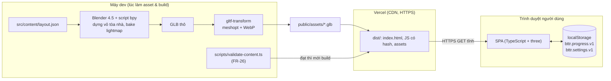
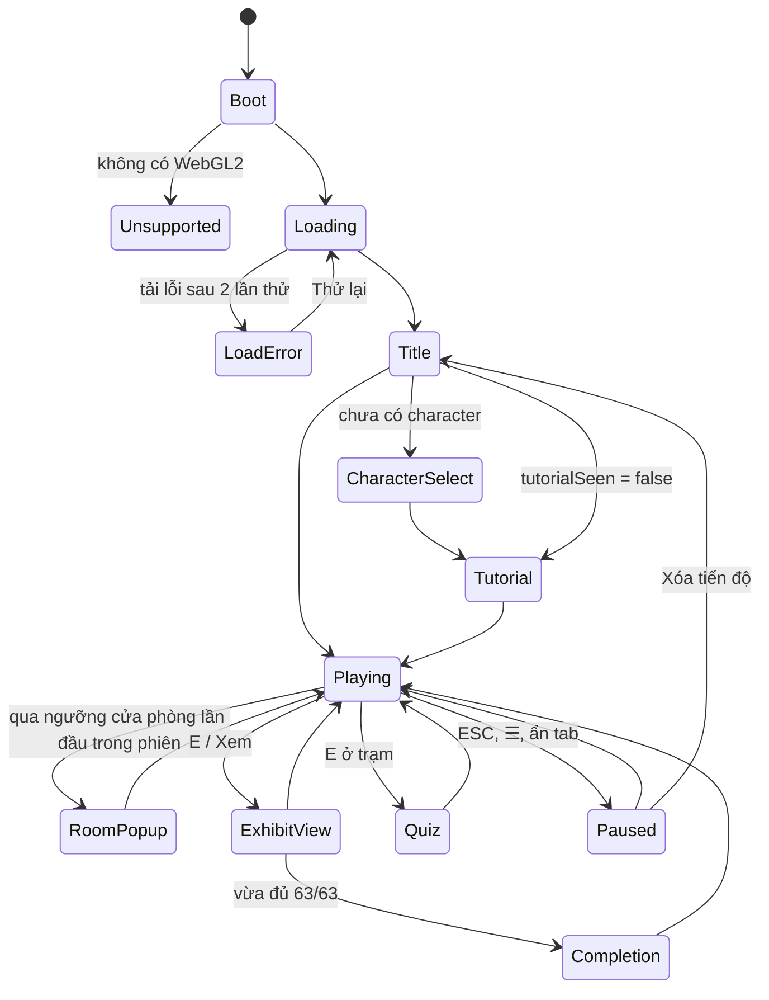

# HLD — Bảo tàng Triết học

| Phiên bản | v1.0 | Ngày | 2026-10-06 | Trạng thái | APPROVED — GATE-2 (anh Duy, 2026-10-06) |
|-----------|------|------|------------|------------|--------------------|

Căn cứ: [BRD v1.0](../ba/BRD.md), [SRS v0.1](../ba/SRS.md), [techstack](techstack.md). Sơ đồ khối đi kèm: [architecture.html](architecture.html).

## 1. Quyết định kiểu kiến trúc

| Câu hỏi quyết định | Trả lời (trích BRD/SRS) | Nghiêng |
|--------------------|-------------------------|---------|
| Quy mô người dùng | Một lớp học, nhóm thử ≥ 5 người, giảng viên chấm; vài chục người truy cập | Monolith |
| Số miền nghiệp vụ & mức độc lập | Một miền: tham quan + ôn tập; các module dùng chung trạng thái tiến độ | Monolith |
| Nhu cầu triển khai/mở rộng độc lập | Không; một bản build tĩnh trên CDN | Monolith |
| Số đội song song & tần suất release | Một người duyệt, Claude làm mọi vai trò; release theo mốc M0–M5 | Monolith |
| Năng lực vận hành | Không có máy chủ; Vercel lo HTTPS/CDN | Monolith |
| Phần chạy phía máy chủ | Không có (BRD: không backend, không đăng nhập) | — |

**Kết luận:** **Ứng dụng web tĩnh một khối (SPA), tổ chức modular monolith phía client**: một bản build, chia module theo tính năng với ranh giới rõ, dùng chung một kho trạng thái tiến độ. Không có backend; dữ liệu nội dung đóng gói lúc build; dữ liệu người dùng chỉ ở `localStorage`. Anh Duy chốt phương án A (Three.js thuần) ngày 2026-10-06.

## 2. Tổng quan kiến trúc



Bên trong SPA (mũi tên = phụ thuộc gọi):

```
                       ┌──────────── core ────────────┐
                       │ app (máy trạng thái), loop,  │
                       │ renderer, quality, events    │
                       └──┬──────┬──────┬──────┬──────┘
          ┌───────────────┘      │      │      └──────────────┐
       world                 player   exhibits             ui (HUD, overlay)
  (load zone, collider,   (nhân vật,  (registry,          ├── quiz
   lightmap, day/night,    controls,   proximity,          └── settings, menu
   fireworks, blockout)    camera)     viewer, 13 🎛)
          │                    │          │                     │
          └──────────┬─────────┴──────────┴──────────┬──────────┘
                  content (layout, exhibits, quiz)   storage (progress, settings)
                  audio ◄── được gọi bởi player, exhibits, world, ui
```

Quy tắc phụ thuộc: `content` và `storage` không phụ thuộc module nào khác; các module tính năng không gọi chéo nhau trực tiếp mà báo qua `core/events` (một `EventTarget` gốc của trình duyệt), trừ khi gọi một hàm thuần của `content`/`storage`.

## 3. Thành phần chính

| Module | Trách nhiệm | Công nghệ | Dữ liệu sở hữu | FR |
|--------|-------------|-----------|----------------|----|
| `core/app` | Máy trạng thái ứng dụng (mục 4.1); chỉ một lớp giao diện mở tại một thời điểm; ESC đóng lớp trên cùng | TS | Trạng thái hiện tại | FR-01, FR-21 |
| `core/loop`, `core/renderer` | Vòng lặp `requestAnimationFrame`, bước mô phỏng cố định ≤ 1/60 s, renderer WebGL2, xử lý mất ngữ cảnh | three | — | FR-01, FR-07 |
| `core/quality` | Áp mức Thấp/TB/Cao (mục 7.3), đo FPS, tự hạ một bậc | three, postprocessing, n8ao | — | FR-22 |
| `world` | Tải vỏ tòa nhà theo khu, gán lightmap, dựng BVH va chạm, vùng kích hoạt cửa phòng, ngày/đêm, pháo hoa; sinh **blockout** từ `layout.json` khi chưa có GLB | three, three-mesh-bvh | Scene, collider | FR-07, FR-08, FR-09, FR-23 |
| `player` | Nhân vật + AnimationMixer, điều khiển bàn phím/chuột/cảm ứng, camera thứ 3/thứ nhất có chống xuyên tường | three, three-mesh-bvh | Vị trí, hướng | FR-02, FR-04 → FR-07 |
| `exhibits` | Đặt hiện vật theo `layout.json`, chọn hiện vật mục tiêu (BR-S09), chế độ xem cận, khuôn chung + 13 module 🎛 | three | Trạng thái 🎛 đang mở | FR-12 → FR-14 |
| `quiz` | Trạm trắc nghiệm: xáo phương án, chấm, giải thích, gợi ý xem lại | TS | Lượt đang làm | FR-16, FR-17 |
| `ui` | HUD, bản đồ nhỏ, popup vào phòng, bảng hiện vật, menu tạm dừng, cài đặt, hướng dẫn, màn hoàn thành, nguồn & giấy phép, thông báo | HTML/CSS | — | FR-03, FR-09 → FR-11, FR-18, FR-20 → FR-22, FR-25, FR-27 |
| `audio` | Nhạc nền, bước chân, hiệu ứng; mở khóa sau thao tác đầu tiên; dừng khi ẩn tab | Web Audio — **tổng hợp lúc chạy** (oscillator + nhiễu lọc, cập nhật M4): không có file âm thanh nên không tốn tải, không cần credits | — | FR-24 |
| `storage` | Đọc/validate/ghi `bttr.progress.v1`, `bttr.settings.v1`; chế độ bộ nhớ tạm khi bị chặn | TS | Progress, Settings | FR-15, FR-19, FR-20 |
| `content` | `layout.json` (phòng, cửa, vị trí hiện vật, trạm trắc nghiệm), `exhibits.ts`, `quiz.ts`, `credits` | TS/JSON | Room, Exhibit, QuizQuestion, Credit | FR-08, FR-13, FR-16, FR-27 |
| `scripts/validate-content.ts` | Kiểm tra toàn vẹn dữ liệu trước khi build | Node 24 | — | FR-26 |
| `tools/blender/*.py` | Đọc `layout.json`, dựng vỏ tòa nhà + mesh va chạm, bake lightmap, xuất GLB theo khu | Blender `bpy` | — | FR-08 |

**Cấu trúc thư mục**

```
index.html · vercel.json · package.json · CREDITS.md
src/
  main.ts
  core/ world/ player/ exhibits/ (exhibits/interactive/ — 13 file) quiz/ ui/ audio/ storage/
  content/  layout.json · exhibits.ts · quiz.ts
scripts/validate-content.ts
tools/blender/        script bpy (build_building.py, bake.py, export.py)
assets-src/           file gốc trước khi nén (texture, GLB thô) — không đưa lên bản build
public/assets/        GLB/ảnh/âm thanh/font đã nén, phục vụ trực tiếp
```

## 4. Luồng chính

### 4.1 Máy trạng thái ứng dụng



Chỉ ở `Playing` thì nhân vật nhận điều khiển và HUD hiện (FR-04 1c, FR-11).

### 4.2 Khởi động và tải dần theo khu (FR-01, BR-S10)
1. `index.html` tải JS chính → kiểm WebGL2 → `storage.load()` → `quality.pickInitial()`.
2. Tải **gói ban đầu**: khuôn viên + sảnh + hành lang, nhân vật, font, âm thanh nền. Tiến trình = byte đã nhận / tổng byte gói (tổng lấy từ manifest sinh lúc build).
3. Vào `Title`. Sau khi người dùng bấm bắt đầu, nạp nền lần lượt Khu A → B → C → phòng ôn tập. Khu chưa xong thì collider cửa khu đóng và biển hiện "Đang chuẩn bị phòng…".
4. Mỗi file thử lại tối đa 2 lần, cách 2 giây; vẫn lỗi → `LoadError` (gói ban đầu) hoặc thông báo kèm nút "Thử lại" ở cửa khu (gói khu).

**Ngân sách dung lượng** (truyền qua mạng, đã nén): JS ≤ 1,5 MB; gói ban đầu tổng ≤ 15 MB (NFR-03); mỗi khu ≤ 10 MB. Build in bảng dung lượng; vượt ngân sách thì báo lỗi ở bước kiểm tra trước GATE-4.

### 4.3 Xem hiện vật (FR-12 → FR-15)
1. Mỗi khung hình `exhibits.proximity` lọc các hiện vật của khu hiện tại, chọn mục tiêu theo BR-S09 (≤ 2 m, ≤ 60°), báo `ui` hiện lời nhắc.
2. E/Xem → `app` sang `ExhibitView` → camera tween tới điểm nhìn trong `layout.json` → `ui` dựng bảng bằng `textContent` từ `content/exhibits.ts`.
3. `storage.markExplored(id)`: nếu là mã mới → thêm vào `explored`, ghi `localStorage`, phát sự kiện `progress-changed` → HUD, bản đồ cập nhật; nếu đủ 63 và `completedShown = false` → `Completion` sau khi đóng bảng.
4. Hiện vật 🎛: module riêng trong `exhibits/interactive/` cài đặt giao diện chung `{ start(), update(dt), isComplete(), reset(), dispose() }`; khuôn chung lo trạng thái Sẵn sàng → Đang thao tác → Hoàn thành (FR-14).

### 4.4 Trắc nghiệm (FR-16, FR-17)
E ở trạm phòng X → `quiz` lấy câu của phòng X từ `content/quiz.ts`, xáo phương án → chấm từng câu, hiện giải thích và gợi ý `exhibitIds` → hết bài: `storage.saveQuiz(X, k, n)` giữ lượt tốt nhất, `mastered` không bao giờ quay về false (trừ khi xóa tiến độ) → sự kiện `progress-changed` → bản đồ hiện ★.

## 5. Tích hợp ngoài
Không có tích hợp lúc chạy. Mọi request của trình duyệt là GET tĩnh cùng nguồn tới Vercel. Nguồn asset (Poly Haven, ambientCG, Quaternius, KayKit, Wikimedia Commons) chỉ dùng lúc làm asset trên máy dev; file được tải về, nén và đóng gói vào bản build.

## 6. Hạ tầng & Môi trường

| Môi trường | Ở đâu | Cách chạy | Dùng cho |
|------------|-------|-----------|----------|
| Dev | Máy anh Duy | `npm run dev` (Vite) | Phát triển, thử nhanh |
| UAT | Vercel Preview (URL riêng cho mỗi nhánh/commit) | Đẩy nhánh lên Git → Vercel build | Nhóm thử, GATE-4, GATE-6 |
| Production | Vercel Production (link nộp đồ án) | Merge vào `master` | Giảng viên chấm |

- **Lệnh build trên Vercel:** `npm run build` = `node scripts/validate-content.ts && tsc --noEmit && vite build`. Bất kỳ bước nào lỗi → deploy thất bại, production giữ bản cũ (NFR-12).
- **Unit test:** `npm test` (Vitest) chạy ở máy dev trước khi đẩy; bắt buộc xanh trước GATE-4.
- **Nhánh:** quy trình rút gọn, một người làm: `feature/<slug>` → PR → `master`. Mỗi nhánh có Preview riêng.
- **Kết nối Vercel** (Git integration hay Vercel CLI) chốt ở B6 cùng anh Duy; không cần dải port vì không có docker-compose.

## 7. Xuyên suốt

### 7.1 Bảo mật & quyền riêng tư
- Không xác thực, không phân quyền (mọi người dùng như nhau, không có dữ liệu cần bảo vệ trên máy chủ).
- **Header** trong `vercel.json` cho mọi đường dẫn:
  - `Content-Security-Policy: default-src 'self'; script-src 'self' 'wasm-unsafe-eval'; style-src 'self'; img-src 'self' data: blob:; media-src 'self' blob:; connect-src 'self'; worker-src 'self' blob:; object-src 'none'; base-uri 'none'; frame-ancestors 'none'; form-action 'none'`
  - `X-Content-Type-Options: nosniff`, `Referrer-Policy: no-referrer`, `Permissions-Policy: camera=(), microphone=(), geolocation=()`.
- Nội dung hiện vật, câu hỏi, credits luôn gán bằng `textContent`/tạo element, không dùng `innerHTML` với dữ liệu (NFR-09).
- Dữ liệu từ `localStorage` coi là không tin cậy: parse trong `try/catch`, validate theo SRS FR-19 trước khi dùng.
- Không cookie, không script bên thứ ba, không analytics (NFR-10). `npm audit --omit=dev` sạch High/Critical trước GATE-5.

### 7.2 Xử lý lỗi
- Lỗi tải, mất ngữ cảnh WebGL, `localStorage` bị chặn: theo SRS FR-01, FR-19.
- `window.onerror` và `unhandledrejection` → ghi console; nếu xảy ra khi đang ở lớp giao diện thì đóng lớp đó và quay về `Playing` để không có popup kẹt (định nghĩa lỗi chặn trong SRS).
- Nhân vật rơi khỏi bản đồ → về sảnh (FR-07 a).

### 7.3 Mức chất lượng (FR-22)

| Thông số | Thấp | Trung bình | Cao |
|----------|------|------------|-----|
| Pixel ratio tối đa | 1,0 | 1,5 | 2,0 |
| Texture | bản 1K | bản 1K | bản 2K |
| Bóng đổ động | Tắt | 1 đèn, map 1024 | 2 đèn gần người chơi, map 2048 |
| Hậu kỳ | Không | SMAA + bloom | SMAA + bloom + N8AO + vignette |
| Lightmap bake | Có | Có | Có |
| Hạt pháo hoa | 25% | 60% | 100% |

Đổi mức không cần tải lại trang, trừ đổi bản texture 1K ↔ 2K (tải thêm texture 2K khi chuyển lên Cao).

### 7.4 Dữ liệu
Toàn bộ dữ liệu là công khai, trừ Progress/Settings là dữ liệu cục bộ không định danh (SRS mục 5). Thêm/sửa nội dung chỉ sửa `src/content/*` (NFR-13); `layout.json` là nguồn duy nhất cho vị trí phòng và hiện vật, dùng chung cho script Blender và runtime.

## 8. Quyết định kiến trúc (ADR ngắn)
- **ADR-01 — Web tĩnh, modular monolith phía client.** Bối cảnh: vài chục người dùng, một miền nghiệp vụ, không backend theo BRD. Quyết định: một SPA build tĩnh, chia module theo tính năng. Hệ quả: không có chi phí vận hành máy chủ; mọi logic chạy trên trình duyệt; không có số liệu sử dụng tập trung (chấp nhận theo A-03).
- **ADR-02 — Three.js thuần, giao diện HTML/CSS.** Bối cảnh: NFR-02/03 khắt khe trên điện thoại; giao diện ít màn. Quyết định: không dùng React/R3F hay Babylon. Hệ quả: tự viết điều khiển nhân vật và camera; gói JS nhỏ nhất.
- **ADR-03 — Va chạm bằng three-mesh-bvh trên mesh va chạm riêng.** Bối cảnh: tòa nhà tĩnh, chỉ một nhân vật. Quyết định: Blender xuất mesh va chạm đơn giản (đối tượng hậu tố `_col`, không render); runtime dựng BVH, kiểm tra viên nang 0,3 × 1,7 m và raycast camera. Hệ quả: không cần engine vật lý; không có nhảy, đẩy vật.
- **ADR-04 — `layout.json` là nguồn duy nhất cho bố cục; có blockout dự phòng.** Bối cảnh: rủi ro Blender trễ (BRD mục 8). Quyết định: script Blender và runtime cùng đọc `layout.json`; khi chưa có GLB của một khu, `world` tự sinh blockout bằng hộp từ `layout.json`. Hệ quả: game chạy được từ M1; nếu đến M3 Blender chưa đạt thì giữ blockout có vật liệu PBR (anh Duy quyết ở GATE-4).
- **ADR-05 — Nén meshopt + WebP, chưa dùng KTX2.** Bối cảnh: KTX2 cần cài thêm KTX-Software. Quyết định: dùng WebP qua gltf-transform. Hệ quả: tải nhỏ, nhưng tốn bộ nhớ GPU hơn KTX2; nếu điện thoại tầm trung không đạt NFR-02/NFR-04 thì chuyển sang KTX2 (cần anh Duy xác nhận thêm công cụ).
- **ADR-06 — Chữ trên pano vẽ bằng Canvas 2D lúc chạy.** Bối cảnh: cần dấu tiếng Việt chuẩn, nội dung đổi được qua dữ liệu. Quyết định: vẽ chữ bằng Canvas 2D với font tự host sau khi font tải xong, cache texture. Hệ quả: không phải sinh ảnh lúc build; tốn vài chục ms lúc tải mỗi khu.
- **ADR-08 — Hình học sinh bằng code, Blender chỉ bake lightmap (cập nhật ở M3, anh Duy đồng ý 2026-10-06).** Bối cảnh: dựng vỏ tòa nhà bằng `bpy` rồi xuất GLB làm hai nguồn hình học phải giữ khớp nhau. Quyết định: `src/world/geometry.ts` sinh hình học từ `layout.json` và UV lightmap (`world/lightmap.ts`, xếp kệ, atlas 2048); `scripts/export-bake.mjs` xuất đúng hình học đó ra OBJ; `tools/blender/bake_lightmap.py` bake Cycles (dải đèn trần, đèn rọi 3200 K, HDRI) + khử nhiễu OIDN ra `public/assets/lightmap.webp`. Hệ quả: runtime không tải GLB tòa nhà; đổi `layout.json` thì chạy lại hai lệnh bake (~2 phút trên GPU); texture CC0 Poly Haven đổi sang WebP 1K/2K bằng `tools/blender/convert_assets.py`.
- **ADR-07 — Giao tiếp giữa module qua `EventTarget` gốc.** Quyết định: dùng `EventTarget` của trình duyệt cho các sự kiện như `progress-changed`, `zone-loaded`, `state-changed`; không thêm thư viện quản lý trạng thái. Hệ quả: ít phụ thuộc; mỗi sự kiện có kiểu dữ liệu khai báo trong `core/events.ts`.
